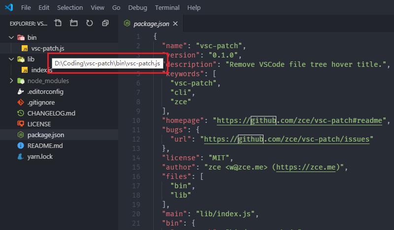

# vsc-patch

[![NPM Downloads][downloads-image]][downloads-url]
[![NPM Version][version-image]][version-url]
[![License][license-image]][license-url]
[![Dependency Status][dependency-image]][dependency-url]
[![devDependency Status][devdependency-image]][devdependency-url]
[![Code Style][style-image]][style-url]

> Remove VSCode file tree hover title.



## Installation

```shell
$ yarn global add vsc-patch

# or npm
$ npm install vsc-patch -g
```

## CLI Usage

```shell
$ vsc-patch --help

Usage: vsc-patch [options]

Options:
  -V, --version    output the version number
  -D, --dir <dir>  VSCode root dir, default 'C:/Program Files/Microsoft VS Code'
  -h, --help       output usage information
```

e.g.

```shell
$ vsc-patch --dir "C:/Program Files/Microsoft VS Code"
Please restart VSCode to see effect.
```

Make sure you have write access rights to the VSCode files.

**Maybe you should run as Administrator.**

## Contributing

1. **Fork** it on GitHub!
2. **Clone** the fork to your own machine.
3. **Checkout** your feature branch: `git checkout -b my-awesome-feature`
4. **Commit** your changes to your own branch: `git commit -am 'Add some feature'`
5. **Push** your work back up to your fork: `git push -u origin my-awesome-feature`
6. Submit a **Pull Request** so that we can review your changes.

> **NOTE**: Be sure to merge the latest from "upstream" before making a pull request!

## License

[MIT](LICENSE) &copy; zce <w@zce.me> (https://zce.me)


[downloads-image]: https://img.shields.io/npm/dm/vsc-patch.svg
[downloads-url]: https://npmjs.org/package/vsc-patch
[version-image]: https://img.shields.io/npm/v/vsc-patch.svg
[version-url]: https://npmjs.org/package/vsc-patch
[license-image]: https://img.shields.io/github/license/zce/vsc-patch.svg
[license-url]: https://github.com/zce/vsc-patch/blob/master/LICENSE
[dependency-image]: https://img.shields.io/david/zce/vsc-patch.svg
[dependency-url]: https://david-dm.org/zce/vsc-patch
[devdependency-image]: https://img.shields.io/david/dev/zce/vsc-patch.svg
[devdependency-url]: https://david-dm.org/zce/vsc-patch?type=dev
[style-image]: https://img.shields.io/badge/code_style-standard-brightgreen.svg
[style-url]: https://standardjs.com
